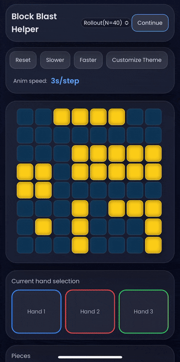

# 🧩 Block Blast Solver

A modern **Progressive Web App** built with **React + TypeScript** that helps you find the best moves for the popular puzzle game **Block Blast**.  
Optimized for **mobile** with a draggable 8×8 board, piece selection, animated solution previews, and theme customization.



---

## 🚀 Features

- **8×8 Interactive Grid**
  - Tap or drag to toggle blocks (mobile-friendly drag works on iOS & Android).
  - Reset button to clear the board instantly.

- **Piece Library**
  - Includes all Block Blast shapes (lines, squares, Z, L, corners, T-shapes, diagonals, and custom shapes).
  - Rotations & mirrored variants automatically included.
  - Grouped by type for quick selection.
  - Clear visual indicator when a piece is selected.

- **Hand Management**
  - Three color-coded hands (Blue, Red, Green).
  - Flexible piece selection for each hand.

- **Best Move Solver**
  - Multiple algorithms to choose from (Greedy, Mobility, Beam Search, etc.).
  - Takes into account clears between moves for optimal placement.
  - Step-by-step preview with continuous animation until you click **Continue**.

- **Animations & Controls**
  - Slower/faster animation speed controls.
  - Highlight overlaps with current filled cells.

- **Customization**
  - Theme customization modal (colors, fonts, preferences).
  - Stores board state and preferences in **LocalStorage**.
  - Mobile layout fits within `100vw`.

- **PWA Ready**
  - Installable on mobile & desktop.
  - Offline support with service worker.
  - Custom app icon (192px, 512px, and maskable versions).

---

## 📦 Installation

```bash
# Clone the repo
git clone https://github.com/yourusername/block-blast-solver.git
cd block-blast-solver

# Install dependencies
bun install

# Start dev server
bun run dev

# Build for production
bun run build
```

---

## 📁 Project Structure

```
src/
  components/       # UI components (Board, PieceSelector, Controls, etc.)
  hooks/            # Custom React hooks
  lib/              # Solver algorithms, board utilities
  types/            # TypeScript type definitions
  pwa.ts            # PWA registration logic (inline SW)
public/
  logo-192.png
  logo-512.png
  manifest.webmanifest
  apple-touch-icon.png
```

---

## 🧠 Algorithms

The solver supports different strategies:

- **Greedy** — Fast & simple, chooses best immediate score.
- **Mobility** — Prefers moves that keep future placement options open.
- **Beam Search** — Looks ahead multiple steps, prunes worst boards.
- (Pluggable — you can add your own in `src/lib/solver`.)

You can change the algorithm in the UI.

---

## 🎨 Theming & Fonts

- Preloaded free Google Fonts: `Poppins`.
- Fully customizable colors and styles via the Theme Modal.
- All preferences are saved locally.

---

## 📱 PWA Notes

- Works offline after first load.
- Supports **Add to Home Screen** with correct icons and splash colors.
- Make sure `manifest.webmanifest` is served from `/` with correct `start_url` and `scope`.
